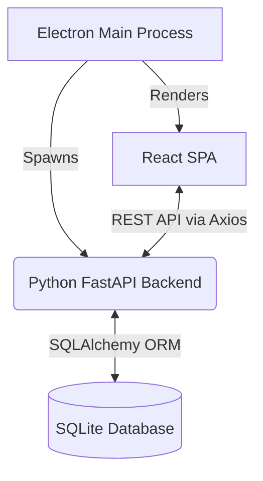

# Techware BillSoft

A modern, local-first Point of Sale (POS) and inventory management desktop application built with FastAPI, React, and Electron.

## Problem Statement

Retail and service businesses require reliable, offline-capable systems to manage their daily operations. Legacy billing software often suffers from poor UI, slow performance, and monolithic architectures that make updates impossible. Techware BillSoft modernizes the local business experience by combining the speed of a web tech stack with the reliability of an offline desktop executable.

## Key Features

- **Point of Sale (POS):** Fast, intuitive cart system for generating invoices and calculating totals.
- **Financial Dashboards:** Real-time reporting on total revenue, net profit, unpaid invoices, and operational expenses.
- **Inventory Management:** Full CRUD capabilities for products and services.
- **Customer CRM:** Track customer details and purchase history.
- **Staff & Expense Tracking:** Maintain employee records and log operational costs.
- **Legacy Migration:** Built-in scripts to seamlessly upgrade from v1.0 (JSON-based) to v2.0 (SQL).

## Architecture

BillSoft is built using a decoupled architecture, packaged as a single desktop application:

1. **Backend Process:** A standalone Python process running FastAPI and SQLite.
2. **Frontend Process:** An Electron application serving a React SPA, communicating with the local backend via REST.



## Technology Stack

- **Backend:** Python 3, FastAPI, SQLAlchemy, Pydantic, Uvicorn, PyInstaller
- **Frontend:** React 19, TypeScript, Tailwind CSS, TanStack React Query, Vite
- **Desktop Packaging:** Electron, Electron Builder
- **Database:** SQLite

## Project Structure

```text
techware_billsoft/
├── backend/                  # FastAPI Application
│   ├── routes/               # API endpoints (auth, invoices, items, etc.)
│   ├── models.py             # SQLAlchemy database models
│   ├── schemas.py            # Pydantic validation schemas
│   ├── database.py           # SQLite connection setup
│   └── migrate_legacy_data.py# V1 to V2 migration script
├── frontend/                 # React SPA & Electron
│   ├── electron/             # Electron main process & preload scripts
│   ├── src/                  # React components, pages, and hooks
│   └── package.json          # Node dependencies and build scripts
└── build.bat                 # Unified build pipeline for Windows
```

## Getting Started

### Prerequisites
- Python 3.10+
- Node.js 20+

### Development Setup

**1. Start the Backend**
```bash
cd backend
python -m venv venv
venv\Scripts\activate
pip install -r requirements.txt
uvicorn main:app --reload --port 8000
```

**2. Start the Frontend**
In a new terminal:
```bash
cd frontend
npm install
npm run dev
```
The application will be available at `http://localhost:5173`.

## Deployment

To package the application into a standalone Windows `.exe` file:

Run the included build script from the root directory:
```cmd
build.bat
```

**What this does:**
1. Compiles the FastAPI backend into a standalone executable using PyInstaller.
2. Builds the React production bundle using Vite.
3. Uses Electron Builder to package the UI and the backend binary into a single installer located in the `release/` directory.

## Security Considerations

- **Local Execution:** The application is designed to run locally. Data is stored in a local SQLite file (`business_v2.db`), ensuring data privacy for the business owner.
- **Authentication:** Role-based access is implemented. Passwords are hashed using SHA-256 before being stored in the database. 

## Future Improvements

- Add automated unit and integration tests for CI/CD pipelines.
- Implement automated database backups to external cloud storage (e.g., AWS S3 or Google Drive).
- Upgrade password hashing from SHA-256 to bcrypt/Argon2.
- Add receipt printer and barcode scanner hardware integrations.

## License

Proprietary Software. © Techware.
